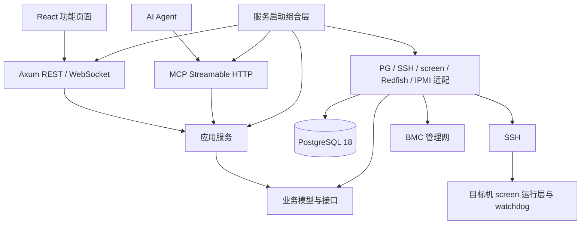

# 架构与模块边界

## 依赖方向

| Cargo crate | 内容 | 允许的内部依赖 |
|---|---|---|
| `rig-domain` | 数据模型、错误、Repository 和设备接口 | 无 |
| `rig-application` | identity、fleet、catalog、flights、mining、jobs、telemetry、bmc、audit 应用服务 | domain |
| `rig-infrastructure` | 各模块 PG Repository、SSH、软件适配器、运行层、BMC、密码与加密 | domain、application |
| `rig-api` | HTTP、WebSocket、MCP、OpenAPI | domain、application |
| `rigdeck` | 环境配置、依赖组装、CLI、服务启动 | 上述模块 |

领域层没有 Axum、SQLx、SSH 或 BMC 具体依赖。传输入口调用应用方法，不能直接访问 Repository。Repository 在 domain 按 identity/fleet/catalog/flights/jobs/telemetry/audit 定义，基础设施在 `pg/` 下分别实现；应用组合层持有聚合接口。新增 SQL 写入放在所属模块，跨模块通过应用服务和持久化作业协调。

前端每个 `features/<feature>/index.tsx` 为公开入口。共享协议来自 `openapi.json` 生成的 `shared/schema.d.ts`，网络调用通过 `openapi-fetch`；共享 UI 和图表在 `shared/`。CI 的 `tests/check_boundaries.py` 检查 Cargo 依赖方向、传输层数据库访问及跨功能内部导入；这是静态边界保护，不替代代码审查。

## 数据和任务

`migrations/0001_core.sql` 是首次建库迁移。关系表保存身份、机器、币种、钱包、矿池、矿工、飞行表任务、作业及目标；外键和唯一约束阻止悬空引用。专用参数及能力有 schema_version 的 JSONB，钱包新币种在事务中创建。编辑使用 revision/version 检测冲突。

提交应用任务时固定机器 ID 和完整钱包、矿池、矿工包 SHA256、任务配置快照。`deployment_versions` 与任务 action 保存渲染结果，机器本地按配置哈希保存版本。软件包字节放磁盘，上传元数据写 PG。

领取任务在短事务内使用 `FOR UPDATE SKIP LOCKED`，全局短 advisory lock 协调并发计数，`machine_locks` 确保同机管理写操作串行。作业默认并发 4、全局最多 8；先验证第一台后放行其他目标。显式包含主控的电源任务将其排在最后。

租约 60 秒、心跳 10 秒；SSH 等待期间不持有数据库事务。重复幂等键和相同输入返回原 job_id，不同输入返回冲突。租约过期只重新查询原 operation_id；未知结果保留机器锁，不盲目重发。完成、取消、人工对账与总任务汇总采用同一个短事务协调锁，防止并发完成导致总状态停留在 running。

PG 故障时不能提交新写操作，已有远端进程与 watchdog 继续；主控恢复后依据远端记录对账。BMC 请求中断不能根据当前 On/Off 推断重启是否执行，因此不自动重发。

## 本地运行层

主控经 SSH 把脚本放到 `/opt/rigdeck/runtime/<hash>`，原子更新 `current`。命令入口为 `/usr/local/bin/rig-miner`，数据根目录 `/var/lib/rigdeck`。不用覆盖目标机已有的 `miner` 命令。

每实例使用一个独立 screen 会话（其中 `miner` 窗口运行 supervisor），便于单实例关闭和重新连接。运行脚本追踪 PID 和 `/proc` 启动身份；停止先持久化意图和 STOP 标记，再 Ctrl+C、等待、只终止自身进程组。watchdog 不恢复人工停止、维护、切换、预热和超出恢复预算的实例。

系统重启时先处理未完成切换：已提交操作按持久化记录确认；未提交且版本未被其他操作改变则恢复旧运行意图，再启动应运行的实例。发现不一致保留 unknown。systemd 仅启动恢复入口和 watchdog，不管理每个矿工。

## 指标与权限

名义周期：系统/矿工 10 秒，软件发现/BMC 电源 30 秒，传感器/事件 60 秒。网络超时可能延长轮次，所有记录有采样时间与错误，前端对过期数据明确降级。矿工统计先由目标机 watchdog 缓存，主控只读取。

原始指标按日分区保留 7 天，分钟聚合 90 天，任务输出 30 天，审计 180 天。分钟 CPU/内存百分比和功率计算均值，其余结构字段保留该分钟最近样本。跨算法算力不相加。

管理员使用 Argon2 密码、服务端会话、安全 Cookie、CSRF 和登录限速。SSH/BMC 凭据用 AES-256-GCM，密钥不在 PG；主机指纹和 Redfish TLS 必须核实。AI 令牌按要求为可撤销的管理员权限，无额外确认流程。终端连接每 15 秒重新校验身份。审计记录终端开启，不记录逐键输入；批量命令保存有上限的输出。
